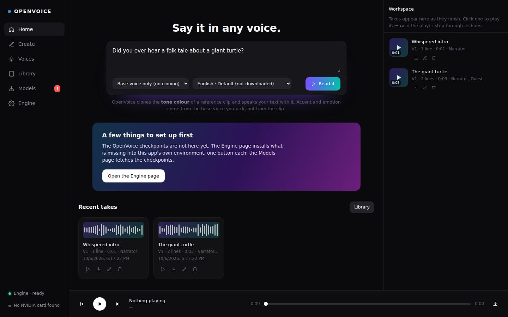
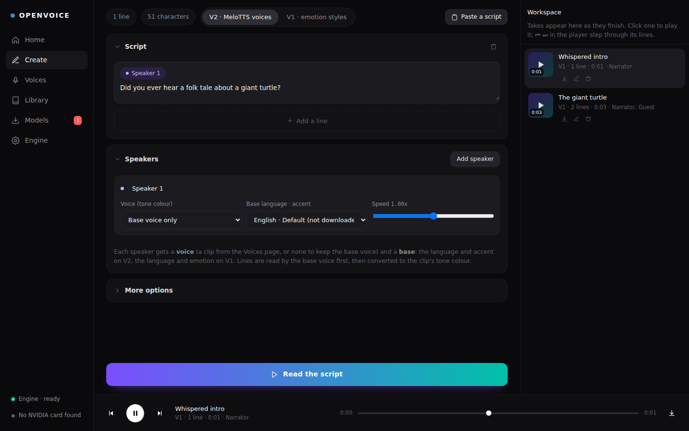
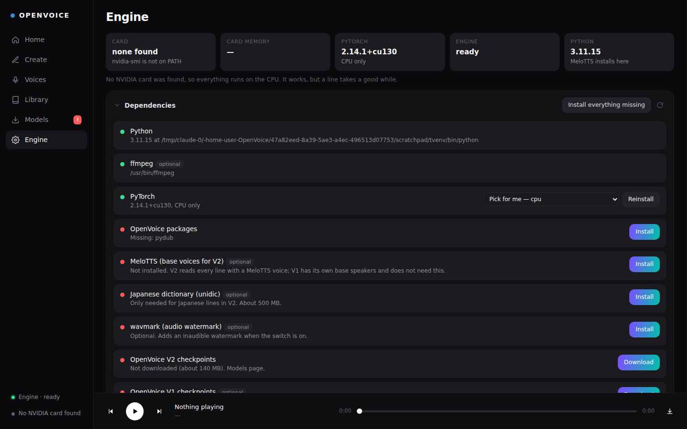
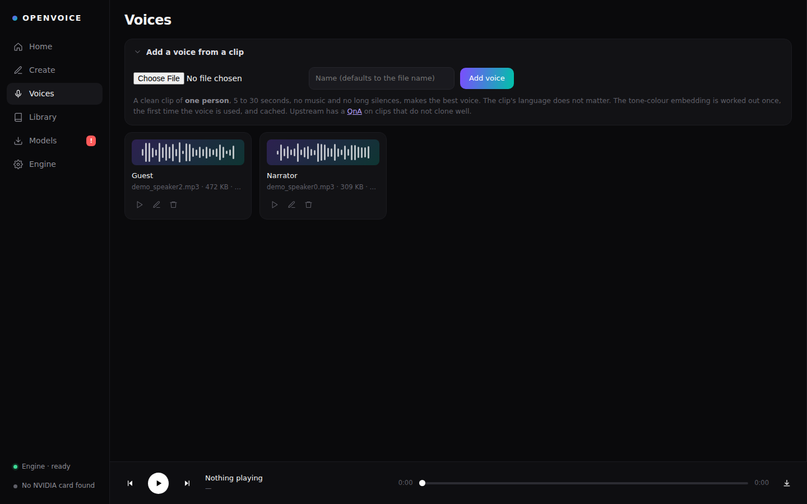
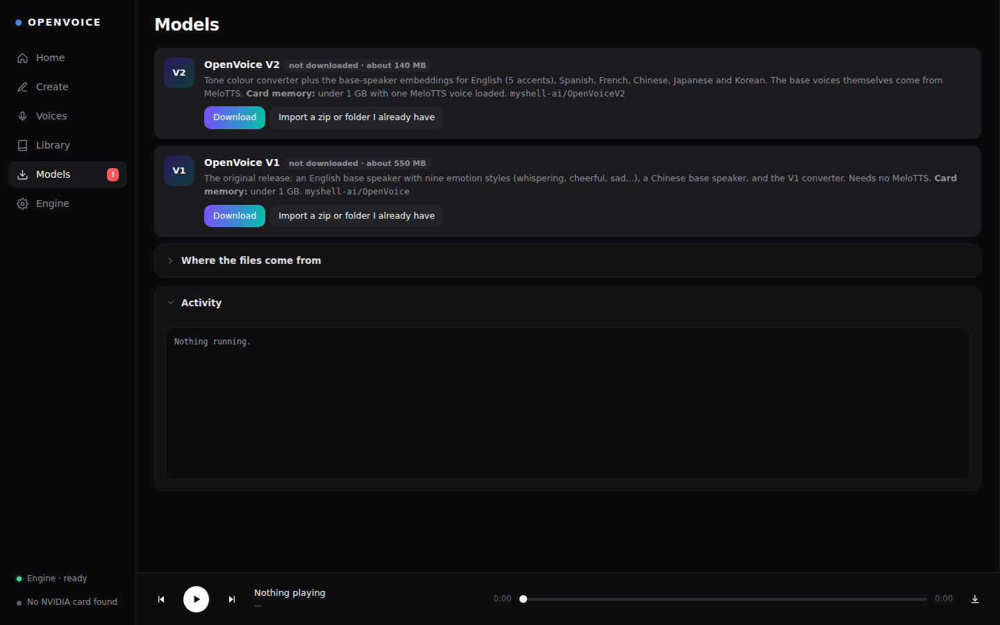

# OpenVoice Studio

A local voice-cloning studio built on [OpenVoice](https://github.com/myshell-ai/OpenVoice)
by MyShell. Drop in a short clip of a voice, write a script, press Read, and it
is spoken in that voice on your own machine — no account, no upload, no
per-word billing. Runs comfortably on an **RTX 4060 with 8 GB**: the whole
stack needs about 2 GB of card memory at its busiest.

Two versions of OpenVoice, switched from the Create page:

| | V2 (default) | V1 |
|---|---|---|
| Base voices | [MeloTTS](https://github.com/myshell-ai/MeloTTS): English in 5 accents, Spanish, French, Chinese, Japanese, Korean | OpenVoice's own: English with 9 emotion styles, Chinese |
| Clone from a clip | yes | yes |
| Extra install | MeloTTS (Python 3.10 or 3.11) | none |
| Checkpoints | about 140 MB | about 550 MB |

OpenVoice clones the **tone colour** of the reference clip. Accent, language
and emotion come from the base voice you choose for each speaker, not from the
clip — which is what lets a five-second English clip read Spanish.

The upstream code (`openvoice/`, the demo notebooks, `docs/`) is here
unchanged apart from one keyword-argument fix in `openvoice/api.py`; the
studio is the files around it.



| Create | Engine |
|---|---|
|  |  |
| **Voices** | **Models** |
|  |  |

---

## Running it

**Windows** — double-click `run.bat`
**macOS / Linux** — `./run.sh`

Either one finds a Python 3.10+ (preferring 3.11), offers to install one if
there is none, puts Flask into a `.venv` beside the script — never into the
Python it found — and starts the server. The browser opens at
<http://127.0.0.1:7811>.

The first launch takes seconds, because nothing heavy is installed yet. The
Engine page then does the rest, one button each or **Install everything
missing**:

| Step | What happens |
|---|---|
| PyTorch | `pip install torch torchaudio --index-url https://download.pytorch.org/whl/<build>` into `.venv`. The build is picked from your NVIDIA driver (cu128 for driver 570+, cu126, cu121) or CPU when there is no card. |
| OpenVoice packages | librosa, soundfile, the text front ends, silero-vad — `requirements-engine.txt` |
| MeloTTS | `pip install git+https://github.com/myshell-ai/MeloTTS.git` plus the NLTK data its English front end wants. Needed for V2 only. |
| Checkpoints | Fetched from HuggingFace on the Models page (see below) |

Every install streams its output into the Activity panel, and the engine is
stopped before an install so a half-imported PyTorch cannot wedge it.

### Requirements

- Python 3.10 or newer. **3.11 or 3.10 for V2**: MeloTTS pins `transformers`
  4.27 and `tokenizers` 0.13, which have wheels for those two only. On 3.12+
  the app and V1 work; MeloTTS will try to build from source and most likely
  fail.
- Git (pip fetches MeloTTS from GitHub).
- ffmpeg on PATH is recommended, for mp3/m4a reference clips. wav and flac
  need nothing.
- An NVIDIA card with 8 GB runs everything here with room to spare. Less
  works with **Free GPU memory after each take** on. No card works too, on
  the CPU, slowly.

### Will it run on this card?

Yes, on anything with a few GB. OpenVoice is small:

| Resident on the card | Approximate |
|---|---|
| Tone colour converter (V1 or V2) | 0.3 GB |
| One V1 base speaker, or one MeloTTS language | 0.3–0.5 GB |
| Silero VAD (while a clip is being embedded) | tiny |
| PyTorch's own CUDA context | 0.3–0.5 GB |

The Engine page reads what the card actually has from `nvidia-smi` and says
so. The engine keeps at most two MeloTTS languages loaded at once, so a script
that walks through six languages never piles six models onto the card, and
every take reports the peak card memory it used.

### Checkpoints: where they come from

The S3 bucket the upstream README links for the checkpoints
(`myshell-public-repo-host`) **no longer exists** — the download links in
`docs/USAGE.md` return NoSuchBucket. The Models page fetches the same files
from HuggingFace instead, file by file with resume:

| Model | Repo | Lands in |
|---|---|---|
| OpenVoice V2 | `myshell-ai/OpenVoiceV2` | `checkpoints_v2/` |
| OpenVoice V1 | `myshell-ai/OpenVoice` | `checkpoints/` |

The repo's file list is read from the HuggingFace API, so nothing is
hard-coded beyond the repo names. A mirror endpoint (such as
`https://hf-mirror.com`) and a token can be set on the same page, and a zip
URL, if you have one, is tried first. **Import a zip or folder I already
have** takes the original `checkpoints_1226.zip` / `checkpoints_v2_0417.zip`
or an unpacked copy from disk, with or without the wrapping folder.

MeloTTS downloads its own base-voice weights from HuggingFace the first time
each language is used — about 200 MB per language, kept in HuggingFace's cache.

### Does it actually work?

The Engine page has **Test V2** and **Test V1**. Each reads one line on your
machine and reports every step:

```
ok    PyTorch imports                        2.5.1+cu124, CUDA on NVIDIA GeForce RTX 4060
ok    OpenVoice V2 is on disk                14 files, 138 MB
ok    The engine starts                      pid 18220
ok    The converter loads                    V2
ok    A reference clip becomes an embedding  9.8s of speech
ok    Speech comes back                      2.6s of audio at 22050 Hz in 3.1s · peak 0.91 GB on the card
```

It stops at the first step that breaks and names it, and a clip of the right
length that is silent counts as a failure.

---

## Around the app

A left rail holds six pages, and the player bar sits across the bottom.

- **Home** — type a line, pick a voice and a base, press Read it. Paste a
  script with `Name: words` lines and it is split by speaker and handed to
  the Create page.
- **Create** — the script builder: lines as blocks, a speaker chip on each,
  a Speakers card that gives every speaker a voice and a base, and the
  options. `Ctrl` + `Enter` reads from anywhere.
- **Voices** — the reference clips. Upload, name, play, delete.
- **Library** — every take, with download.
- **Models** — the checkpoints and the HuggingFace settings.
- **Engine** — dependencies, PyTorch build, the self-tests, the engine
  process and its console.

### Voices

A clean clip of **one person**, 5 to 30 seconds, no music and no long
silences, gives the best clone. The clip's language does not matter. The
tone-colour embedding is worked out the first time a voice is used (speech is
found with Silero VAD, the same detector upstream uses, split into ~10 s
pieces and averaged, as upstream does) and cached by the clip's contents, so
a renamed file is still the same voice and an edited one is a new one.
Upstream's [QnA](docs/QA.md) covers clips that do not clone well.

### Speakers and bases

Each speaker on the Create page has a **voice** (a clip, or none to keep the
base voice as it is) and a **base**:

- on V2, a language and accent from MeloTTS — English Default / American /
  British / Indian / Australian, English (newest model), Spanish, French,
  Chinese, Japanese, Korean;
- on V1, English with a style — default, whispering, shouting, excited,
  cheerful, terrified, angry, sad, friendly — or Chinese.

Each line is read by the base voice first and then converted to the clip's
tone colour. Japanese on V2 needs the unidic dictionary, a separate button on
the Engine page (about 500 MB).

### More options

- **Pause between lines** — silence inserted when lines are joined.
- **Cloning strength (tau)** — the converter's temperature, 0.3 by default
  as upstream uses. Lower is closer to the base voice.
- **Free GPU memory after each take** — drops every model from the card
  once the take is joined; the next take loads them again.
- **Watermark** — MyShell's inaudible watermark, through the optional
  `wavmark` package. Off by default. Note upstream's remark that MyShell can
  detect OpenVoice output with or without it.

### Takes

Every run is a take: one wav per line plus the joined file, all at the
converter's 22.05 kHz. The workspace column shows the line being read and
lists the takes; the player's ⏮ ⏭ step through a take's lines. Takes live
in `data/takes/`, voices in `data/voices/`, embeddings in `data/se/`.

---

## Troubleshooting

**"PyTorch installed but it cannot see the card"** — the build does not
match the driver. Pick one by hand in the Engine page: cu128 needs driver
570+, cu126 560+, cu121 is for older drivers. Update the driver if in doubt.

**MeloTTS will not install** — almost always Python 3.12 or newer. Run the app
on 3.11: install it, delete `.venv`, run `run.bat` / `run.sh` again (the
launchers prefer 3.11 when it is there).

**"The card ran out of memory"** — rare on 8 GB, but another program may be
holding most of it. Close it, or turn on Free GPU memory after each take.

**Out of memory on the CPU / very slow** — V2's MeloTTS is the heavy part on a
CPU. V1 is lighter.

**A take fails on a Japanese line** — install the Japanese dictionary from
the Engine page.

**The first line after a start takes a while** — it is loading the models.
The next lines reuse them.

**Reference clip in mp3 fails to decode** — install ffmpeg, or convert the
clip to wav.

---

## Layout

```
run.sh, run.bat         Launchers — find Python, build .venv, start server.py
requirements.txt        Flask and requests: what the launchers install
requirements-engine.txt What the Engine page installs on top of PyTorch
server.py               Flask API — jobs, takes, voices, setup, the engine process
engine.py               The worker: loads OpenVoice (and MeloTTS), embeds clips, speaks
manager.py              Dependency checks and installers, checkpoint downloads
web/index.html          The interface — one file, no build step
openvoice/              Upstream OpenVoice, unchanged bar one fix in api.py
tests/                  Unit tests and a stand-in engine, no GPU needed
docs/, demo_part*.ipynb Upstream documentation and notebooks
data/                   config, voices, takes, embeddings (created on first run)
```

Port: set `OPENVOICE_STUDIO_PORT`. `OPENVOICE_STUDIO_NO_BROWSER=1` stops it
opening a tab. `OPENVOICE_STUDIO_DATA` moves `data/`.

## Tests

```bash
python tests/check.py                                   # compiles, inline script parses
python -m unittest discover -s tests -p 'test_*.py' -v  # 29 tests, Flask only
```

`tests/mock_engine.py` stands in for `engine.py`, so the suite needs no
PyTorch, no checkpoints and no card, and runs against a temporary data folder.
Both run in CI on every push and pull request.

## Licence and credit

OpenVoice V1 and V2 are MIT licensed by MyShell — see `LICENSE`. Please read
their [paper](https://arxiv.org/abs/2312.01479) and the
[original README](https://github.com/myshell-ai/OpenVoice) for the method and
its authors: Zengyi Qin, Wenliang Zhao, Xumin Yu and Ethan Sun.
